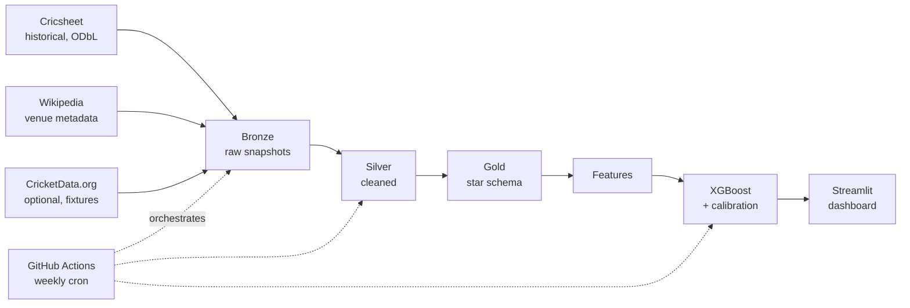
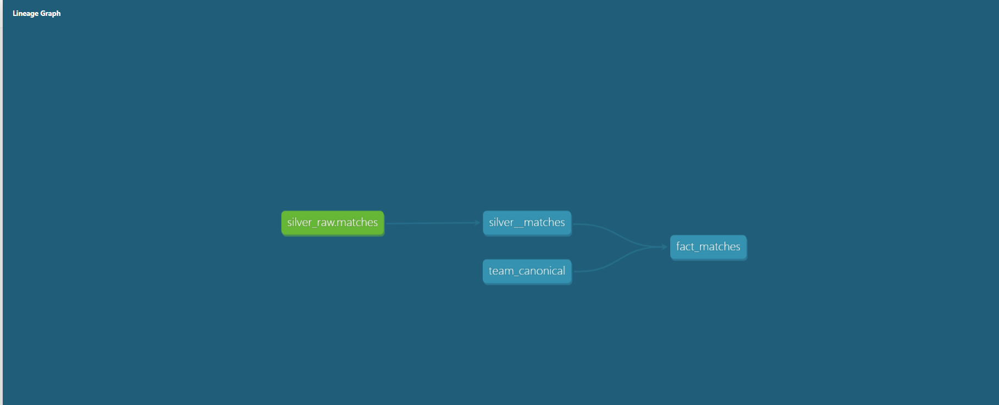
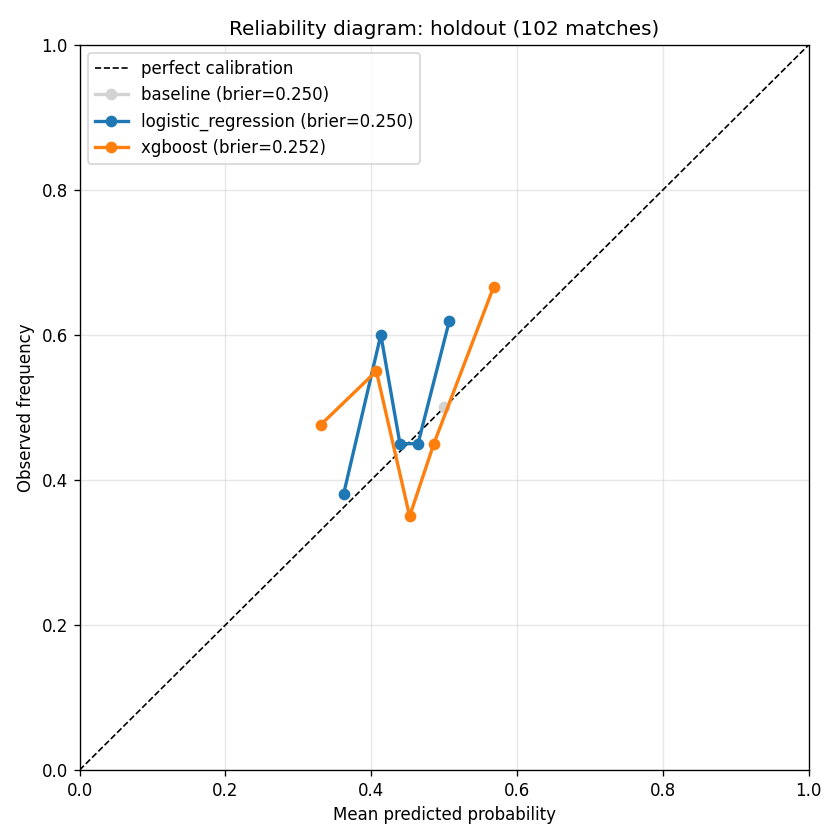
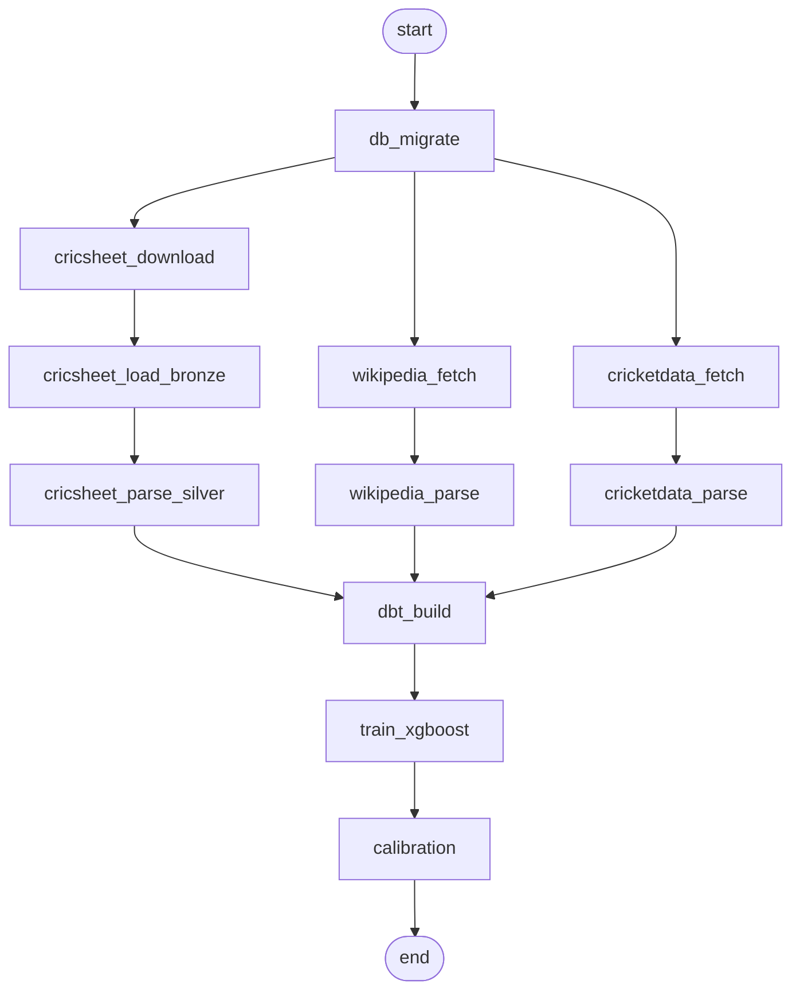

# IPL Winner Prediction

End-to-end data engineering pipeline for IPL match prediction. Built on **licensed open data and official APIs only** — no Terms-of-Service compromises. Demonstrates ingestion, warehousing, transformation, ML, and serving on free-tier tooling.

**Status:** Complete (all 8 phases shipped).
🚀 **[Live demo](https://ipl-winner-prediction-sample.streamlit.app/)** • [](https://github.com/dharmicreddy/ipl-winner-prediction/actions/workflows/weekly_pipeline.yml)

## Quick start

```bash
# 1. Copy env template and adjust if needed
cp .env.example .env

# 2. Bring up Postgres
docker compose -f docker/docker-compose.yml --env-file .env up -d

# 3. Create a virtualenv and install
python -m venv .venv
source .venv/bin/activate    # Windows: .venv\Scripts\Activate.ps1
pip install -e ".[dev]"

# 4. Apply DB migrations
python -m ingestion.db.migrate

# 5. Download & load Cricsheet data (2022–2024 by default)
python -m ingestion.cricsheet.downloader
python -m ingestion.cricsheet.bronze_loader
python -m ingestion.cricsheet.silver_parser

# 6. Fetch Wikipedia venue metadata (CC BY-SA)
python -m ingestion.wikipedia.venue_client
python -m ingestion.wikipedia.venue_parser

# 7. Fetch upcoming fixtures from CricketData.org (requires API key in .env)
python -m ingestion.cricketdata.fixtures_client
python -m ingestion.cricketdata.fixtures_parser

# 8. Build the dbt warehouse (silver + gold views, seeds, tests)
dbt deps --project-dir warehouse
dbt seed --project-dir warehouse
dbt build --project-dir warehouse

# 9. Launch the dashboard
streamlit run dashboard/app.py

## Why this project

IPL is a good modeling target: abundant open historical data, clear binary outcomes per match, strong seasonal effects, and a tournament structure that rewards probability calibration. This project is intentionally built on licensed open data and official APIs only — every source has a documented legal basis; see `docs/data-sources.md`. Most IPL-prediction portfolios on GitHub scrape sources that prohibit automated access; this one does not.

## Architecture



**Read path:** sources -> bronze -> silver -> gold -> features -> model -> dashboard.
**Orchestration:** GitHub Actions runs the pipeline weekly. Airflow DAGs exist locally for demonstration.

## dbt warehouse

The data warehouse is built via [dbt](https://www.getdbt.com/) with all models defined in `warehouse/`. Run `dbt build --project-dir warehouse` to rebuild silver and gold layers, run all data tests, and load the team-canonical seed.



**Layers:**
- **silver_raw** (Python-populated): typed rows ingested from Cricsheet, Wikipedia, and CricketData.org
- **silver** (dbt views): cleaned views over silver_raw, source for the gold layer
- **gold** (dbt views): analytical models with derived columns (e.g. `batting_first_won`), entity-resolved teams via the `team_canonical` seed, and a star schema (`fact_matches`, `fact_ball_by_ball`, `dim_teams`, `dim_venues`, `dim_players`)

A snapshot model (`warehouse/snapshots/dim_teams_snapshot.sql`) tracks team rebrandings (e.g. "Royal Challengers Bangalore" → "Royal Challengers Bengaluru") with SCD Type 2 semantics. To explore model documentation interactively: `dbt docs generate --project-dir warehouse && dbt docs serve --project-dir warehouse`.

## Modeling

Three classifiers compared on a strict walk-forward split (train: 2022, val: early 2023, holdout: late 2023 + 2024):

| Model | Holdout Accuracy | Brier Score | ECE |
|---|---|---|---|
| Majority-class baseline | 0.500 | 0.250 | 0.000 |
| Logistic regression (calibrated) | 0.529 | 0.250 | 0.063 |
| **XGBoost (calibrated)** | **0.598** | 0.252 | 0.091 |

XGBoost beats baseline by **9.8pp on accuracy**. Calibration is imperfect — see [`docs/img/calibration_holdout.png`](docs/img/calibration_holdout.png) and [`docs/MODEL_CARD.md`](docs/MODEL_CARD.md) for the honest writeup.



All runs tracked in MLflow at `./mlruns`. View with:

```bash
mlflow ui --backend-store-uri ./mlruns --port 5000
```

## Orchestration

The full pipeline runs two ways with **shared Python entrypoints — no duplicate logic**.

### DAG structure



### GitHub Actions (production)

`.github/workflows/weekly_pipeline.yml` runs the full pipeline weekly.

- **Trigger**: cron `0 6 * * 2` (Tuesdays at 06:00 UTC, IPL season) or manually via the Actions tab
- **Environment**: ephemeral Postgres 16 service container; fresh state per run
- **Secrets**: `CRICKETDATA_API_KEY` stored in GitHub Actions secrets
- **Artifacts**: each run uploads the calibration reliability diagram and MLflow runs as downloadable artifacts (30-day retention)
- **Failure alerting**: GitHub emails the repository owner on workflow failure

> **Note**: GitHub Actions cron schedules are best-effort; runs may be delayed by up to ~1 hour during peak load on the free tier. For production-grade scheduling, a paid scheduler (Cloud Scheduler, Cloud Run Jobs, etc.) would be more reliable. For this project's portfolio purpose, weekly best-effort is adequate.

### Airflow (local demo)

Airflow runs locally for demonstration purposes. The same `ipl_pipeline` DAG with the same task definitions runs both inside Airflow and inside GitHub Actions.

```bash
# Bring up the application Postgres
docker compose -f docker/docker-compose.yml --env-file .env up -d

# Bring up the Airflow stack (LocalExecutor; ~3-4 min first boot)
docker compose -f docker/airflow-compose.yml --env-file .env up -d

# Visit http://localhost:8080 (admin / admin) and trigger the DAG
# Or trigger via CLI:
docker compose -f docker/airflow-compose.yml exec airflow-scheduler airflow dags trigger ipl_pipeline
```

The Airflow stack uses LocalExecutor (one webserver, one scheduler, one Postgres metadata DB). Code is mounted read-only; specific writable paths are configured for dbt logs (`DBT_LOG_PATH`), dbt build artifacts (`DBT_TARGET_PATH`), MLflow runs, and the calibration PNG. See [ADR-001](docs/decisions/001-hosting-and-orchestration.md) for the rationale on running Airflow locally vs. paid cloud.

## Tech stack

| Layer | Choice |
|---|---|
| Ingestion | Python + httpx (API / bulk download only) |
| Warehouse | PostgreSQL (Docker local, Neon free optional) |
| Transformation | dbt Core |
| ML | scikit-learn -> XGBoost + calibration, MLflow tracking |
| Orchestration | GitHub Actions (prod) + Airflow (local demo) |
| Dashboard | Streamlit Community Cloud |
| CI | GitHub Actions |

## Live dashboard

The dashboard is deployed to Streamlit Community Cloud:
**[ipl-winner-prediction-sample.streamlit.app](https://ipl-winner-prediction-sample.streamlit.app/)**

Three interactive pages:

- **Predict** — pick two teams, a venue, and a match date; the calibrated XGBoost classifier returns a win probability with confidence breakdown. All features are computed strictly as-of the match date — no leakage.
- **Calibration** — interactive Plotly reliability diagram showing how well predicted probabilities match actual win rates on the 102-match holdout. Includes ECE (0.091) and Brier score (0.252) with comparison vs. baseline.
- **Data** — match-level explorer showing bat-first win rates and seasonal trends across 218 matches.

The deployed app reads from a bundled SQLite snapshot of the warehouse (committed at `dashboard/data/ipl.sqlite`). The same code runs locally against Postgres when `POSTGRES_HOST` is set — see `dashboard/lib/data.py`. To refresh the snapshot, run `python -m scripts.build_dashboard_assets` and commit the regenerated files.

See the ADRs in `docs/decisions/` for the rationale behind each choice.

## Repository layout

```
ipl-winner-prediction/
├── README.md
├── docs/
│   ├── problem-definition.md
│   ├── data-sources.md
│   └── decisions/            # ADRs
├── ingestion/                # Phase 2+
├── warehouse/                # dbt project, Phase 4
├── features/                 # Phase 5
├── models/                   # Phase 6
├── dashboard/                # Streamlit app, Phase 8
├── orchestration/            # Airflow DAGs + GH Actions workflows
├── tests/
├── docker/
├── .github/workflows/
├── pyproject.toml
└── .env.example
```

## Roadmap

| Phase | Focus | Status |
|---|---|---|
| 1 | Discovery & design | Complete |
| 2 | Historical backfill (Cricsheet) | Complete |
| 3 | Incremental API ingestion | Complete |
| 4 | dbt warehouse | Complete |
| 5 | Feature engineering | Complete |
| 6 | Modeling + calibration | Complete |
| 7 | Orchestration | Complete |
| 8 | Dashboard + write-up | Complete |

End of Phase 8: A multipage Streamlit dashboard is deployed to Streamlit Cloud with interactive prediction, calibration analysis, and data exploration. The deployed app reads from a SQLite snapshot bundled in the repo, while local development runs against Postgres. See [`docs/WRITEUP.md`](docs/WRITEUP.md) for a narrative summary of the project decisions and lessons learned.

## Attribution

- Historical match data: [Cricsheet](https://cricsheet.org) — licensed under the [Open Database License (ODbL)](https://opendatacommons.org/licenses/odbl/1-0/).
- Venue metadata: [Wikipedia](https://en.wikipedia.org) — CC BY-SA 4.0.
- Upcoming fixtures: [CricketData.org](https://cricketdata.org) — used per their published terms of service.

## License

Code: MIT. Derived data retains the license of its source (Cricsheet: ODbL; Wikipedia: CC BY-SA).
