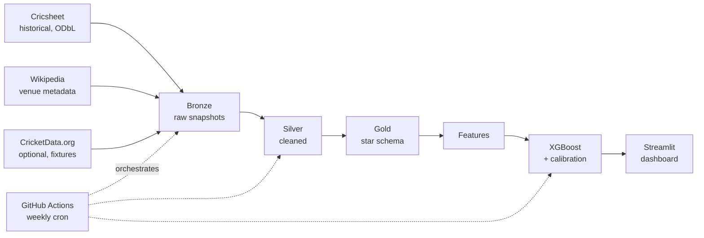

# IPL Winner Prediction

End-to-end data engineering pipeline for IPL match prediction. Built on **licensed open data and official APIs only** — no Terms-of-Service compromises. Demonstrates ingestion, warehousing, transformation, ML, and serving on free-tier tooling.

**Status:** Phase 1 — Discovery & Design (complete). Next: Phase 2 — Historical backfill from Cricsheet.

## Why this project

IPL is a good modeling target: abundant open historical data, clear binary outcomes per match, strong seasonal effects, and a tournament structure that rewards probability calibration. This project is intentionally built on licensed open data and official APIs only — every source has a documented legal basis; see `docs/data-sources.md`. Most IPL-prediction portfolios on GitHub scrape sources that prohibit automated access; this one does not.

## Architecture

**Read path:** sources -> bronze -> silver -> gold -> features -> model -> dashboard.
**Orchestration:** GitHub Actions runs the pipeline weekly. Airflow DAGs exist locally for demonstration.

## Tech stack

| Layer | Choice |
|---|---|
| Ingestion | Python + requests (API / bulk download only) |
| Warehouse | PostgreSQL (Docker local, Neon free optional) |
| Transformation | dbt Core |
| ML | scikit-learn -> XGBoost + calibration, MLflow tracking |
| Orchestration | GitHub Actions (prod) + Airflow (local demo) |
| Dashboard | Streamlit Community Cloud |
| CI | GitHub Actions |

See the ADRs in `docs/decisions/` for the rationale behind each choice.
